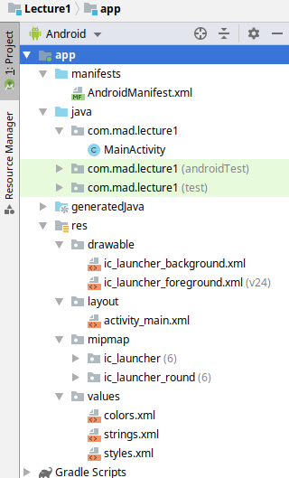

# Lecture 1 - Android Studio Basics
### 1. Setting-up Android Studio
We're going to keep up-to-date with the latest features brought by Android Studio. The steps below will show you how to do that.

1. Install Android Studio [here](https://developer.android.com/studio/install).  
    - Install the latest version of Android Studio
2. Install the latest SDK in Android Studio by going to Tools -> SDK Manager -> SDK Platforms -> Android SDK  
3. Install the latest Tools in Android Studio by going to Tools -> SDK Manager -> SDK Tools.  
4. Now restart Android Studio.

### 2. Folder Structure
Assuming you're viewing the ```Android``` folder structure on Android Studio, the files and folders
below are essential to understanding how Android development works.

</img>

##### Gradle Scripts:
The gradle scripts contain the configurations to develop your app.

1. ```build.gradle (Project)```: Configuration for all modules
    - A module is like a project from the Eclipse IDE
2. ```build.gradle (Module)```: Configuration for individual modules
    - Dependency management, API version, etc.

In MAD, we're only going to worry about the ```build.gradle (Module)``` file.

##### app folder:
The app folder contains the source code and assets used to create your app.

1. ```manifests``` folder:
    - ```AndroidManifest.xml```: App's permissions, orientation, configuration of app themes, etc.
        - Presents essential information about your app to the phone

2. ```java``` folder:
    - ```main``` source folder: Contains the primary Java source code that your app runs on
    - ```androidTest``` source folder: Unit tests to test your Android app's functionality
    - ```test``` source folder: Pure Unit tests that are not Android-specific

    In MAD, we're only going to focus on the ```main``` source folder.

3. ```res``` (resource) folder:
    - ```drawable``` folder: Visual assets such as images, backgrounds, etc.
    - ```layout``` folder: Page and component designs
    - ```mipmap``` folder: Your app's icon that's shown when downloading it on the phone
    - ```values``` folder: Configuration files such as texts, styling, etc.
        - The ```values``` folder is very important for [locales](https://developer.android.com/training/basics/supporting-devices/languages)

### 3. XML Layout
An Android app's layouts (UI) are coded in XML. XML is a markup language that is very similar to HTML.
In fact, if you've ever worked with HTML before, then XML would be very easy to grasp since the concepts are the same.

Fortunately, we don't need to code any layouts because Android Studio provides a drag-and-drop XML layout tool!

##### activity_main.xml
Head on over to the ```res/layout``` folder to see all of your layout files.

In a fresh new empty Android Studio project, you should see a file called ```activity_main.xml```.
This file is the first page (also referred to as an activity) that will show when your app loads.

Open the activity_main.xml file in Android Studio, and a design and text tab should appear.
- The design tab is the drag-and-drop tool that Android Studio provides to create the layout
- The text tab is the XML code for the layout

##### Constraint Layout
ConstraintLayout is a powerful, and typically the most effective, layout within Android Studio. The layout
constraints each element within the layout to other element.These constraints positions your elements to the
size of the phone, so the element's position would be flexible to the phone's screen size.

For example, an element that is constrained to the top, bottom, left, and right of the phone screen aligns to the middle
of the screen because the element's being "dragged" (constrained) by all four sides of the screen.

To automatically add constraints to all elements in a layout, click the magic-wand (Infer constraints) button.  
To delete all constraints to all elements in a layout, click the constraint-X (Clear All Constraints)  button.

This lecture uses the Constraint Layout in the ```activity_main.xml``` file.

##### Relative Layout
RelativeLayout is a layout that positions the elements relative to other elements.

For example, an element can be positioned to the left of another element, or on top of an element, etc.

##### Linear Layout
A layout that can "stack" elements vertically or push elements horizontally.

##### Element Ids
Each element must have a unique id to distinguish it from other elements. This is necessary for referencing
the elements from the layout to the Java source code.

For instance, in this lecture's ```activity_main.xml```, the purple button has an id of ```purpleBTN``` while
the top text has an id of ```headerText```.

##### Element Attributes
Each element has their individual attributes, which can be edited within the UI tool in Android Studio.

For instance, in this lecture's ```activity_main.xml```, you can see a button with a purple background color
and green button text. These were attributes that were modified from the original button.
- backgroundTint modified the background's color
- textColor modified the text's color

To best understand an element's attributes, you just need to play around with them and keep modifying them.

### 4. Java Source Code
An Android app's source and functionality are coded in Java. Java is a high-level language that is similar to C.  
If you've ever worked with a C-based language before, then Java's syntax would seem familiar to you.

##### MainActivity.java
Head on over to ```java/com.mad.lecture1``` to see all of your source code files.

Similar to the XML Layout's ```activity_main.xml```, the ```MainActivity.java``` file is the source code to the
first page (also referred as an activity) that will show when your app loads.

The ```MainActivity.java``` is linked to your ```activity_main.xml``` in the ```onCreate``` method using
the ```setContentView(R.layout.activity_main)``` function. This function links the Java source code to the
XML layout, which allows you to access the elements from XML within the Java code.

### 5. Logcat
Although the standard Java console works in Android Studio, Android programmers are advised to use Logcat.
- Logcat: A command-line tool that dumps a log of system messages for debugging
- To start Logcat, go to Run -> Debug 'app'

There are multiple methods to logging messages onto Logcat, some of them are:
- ```Log.d```: Debug messages
- ```Log.e```: Error messages
- ```Log.i```: Info messages
- ```Log.v```: Verbose messages
- ```Log.w```: Warning messages


```System.out.println```, like in standard Java, is used to print outputs onto the Java console. In contrast,
```Log.d``` is used to log debug messages onto the Logcat console.

You may use ```System.out.println``` for logging messages, but it's conventional to just use ```Log```.

### 6. Running The App
You can either install an Android emulator or use your Android phone to run the app.

##### Using an Emulator:
1. Run -> Run 'app' -> Create New Virtual Device  
2. Install a new Android device on your computer.  
3. Once installed, click Run -> Run 'app' -> Then choose your emulator that you installed

##### Using an Android Phone
1. Go to your Android phone's Settings -> System
2. Click the "About Phone" multiple times until Developer options is enabled.  
3. Go to Developer Options -> Enable USB debugging  
4. In Android Studio, Run -> Run 'app' -> Then choose your Android phone.

If you are debugging the app, then choose Debug 'app' instead of Run 'app' in Android Studio.
- Debugging is helpful for live code reloading and logging messages with Logcat
