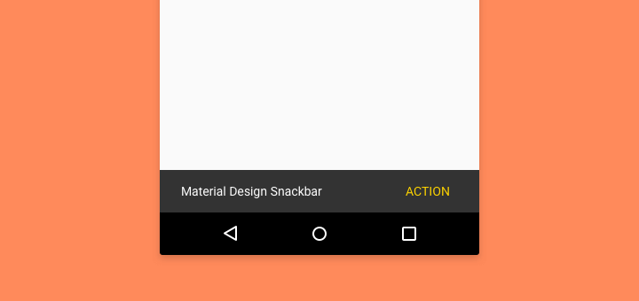

# Lecture 5 - Dependencies, Snackbar, Picasso
### 1. Dependencies
A dependency is a a piece of software that another software relies on to function.

For instance, an Android app that relies on the Facebook integration API dependency for for Facebook
integration to function properly in the app.

### 2. Snackbar
The first dependency we're going to install is called "Snackbar". A Snackbar is an alert UI component
that shows a message in your Android app.

</img>

Let's install the Snackbar dependency on our Android app! These steps have already been done in this
repository, but follow along to see how it was done.
1. Open the ```build.gradle Module: app```  file.
2. Under the dependencies, add this piece of code: ```implementation 'com.android.support:design:28.0.0'``
    - This installs the Android Design Support dependency, which contains material design components
        created by Google like the Snackbar
3. Sync your Gradle scripts, then re-build your Android application.

Now that the Android Design Support dependency is installed, we can import the Snackbar onto our Java
code from the dependency we just installed.
1. Import the Snackbar class in the top of the ```MainActivity.java``` class:
```import com.google.android.material.snackbar.Snackbar;```
2. In your ```MainActivity.java``` file, add these lines of code inside the ```onCreate``` method:
```java
View contentView = findViewById(android.R.id.content);
Snackbar.make(contentView, "Loaded the Android app!", Snackbar.LENGTH_LONG).show();
```

The Snackbar has been set-up! Now whenever you load the application, it will show a Snackbar that
says "Loaded the Android app!" on your Android app.

### 3. Picasso
The second depdenency we're going to install is called "Picasso". Picasso is a power image library
for Android that can download, cache, or just view images in your Android app.

Let's install the Picasso dependency on our Android app! These steps have already been done in this
repository, but follow along to see how it was done.
1. Open the ```build.gradle Module: app```  file.
2. Under the dependencies, add this piece of code: ```implementation 'com.squareup.picasso:picasso:2.71828'``
    - This installs the Picasso dependency
3. Sync your Gradle scripts, then re-build your Android application.

Now that Picasso is installed, let's add an ImageView on our ```main_activity.xml``` to use as a
component that we can load an image onto later using Picasso.
1. Drag and drop an ImageView onto the ```main_activity.xml```, make sure to add the constraints!
2. Use any placeholder image for the ImageView, it will change later using Picasso, anyway.
3. Set the id of the ImageView to "picassoImage".

We're going to load an image from the Internet and display it on the ImageView we just created, but
first we need to request Internet permissions on the Android app.
1. Go to the ```manifests/AndroidManifest.xml``` file.
2. Add this line of code within the ```manifest``` element:
```<uses-permission android:name="android.permission.INTERNET" />```

Now let's load an image from online onto the ImageView we created.
1. Add this piece of code in ```MainActivity.java``` inside the ```onCreate``` method:  
```java
ImageView picassoImage = (ImageView) findViewById(R.id.picassoImage);
String url = "https://avatars3.githubusercontent.com/u/5356292?s=200&v=4";
Picasso.get().load(url).into(picassoImage);
```
This loads the image from the ```url``` Java variable into the ImageView.